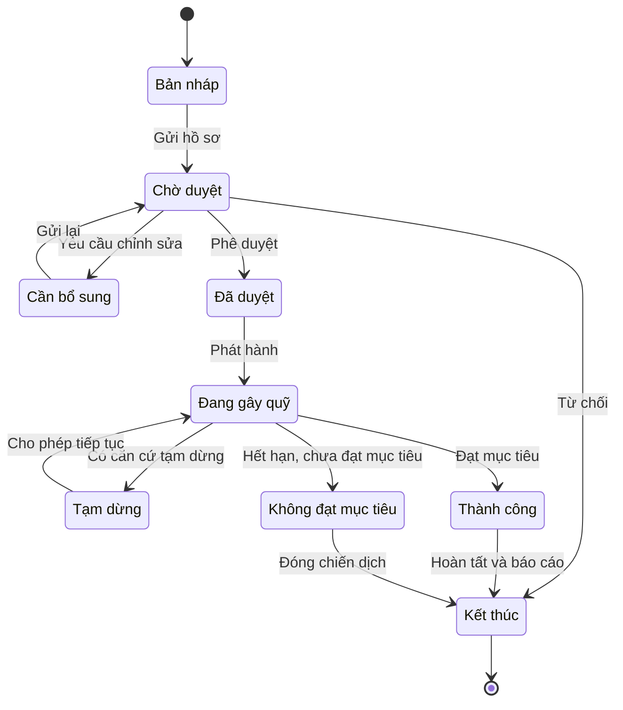
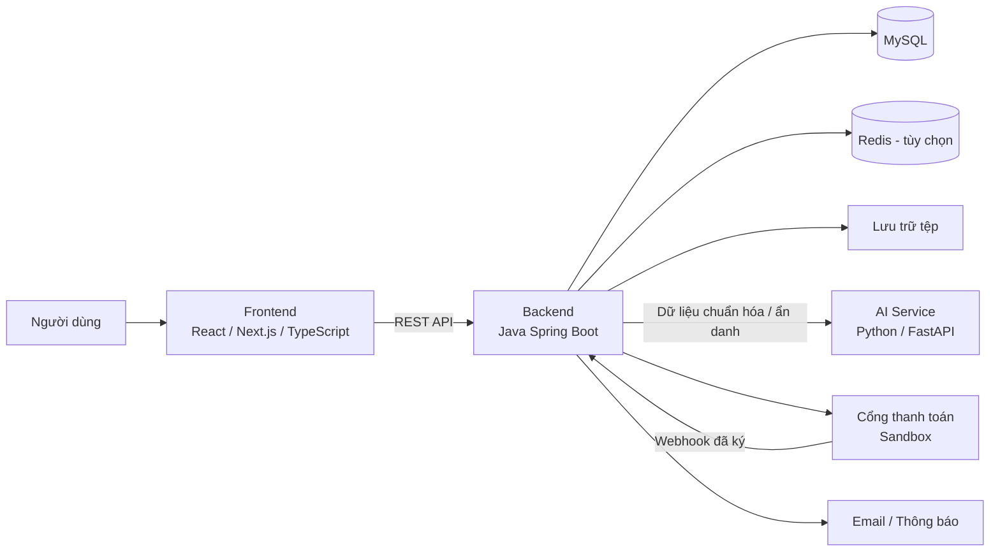

# Nền tảng gây quỹ cộng đồng cho dự án xã hội và khởi nghiệp

> Nền tảng web hỗ trợ toàn bộ vòng đời của một chiến dịch gây quỹ, từ khởi tạo, xét duyệt, kêu gọi tài trợ và thanh toán đến cập nhật tiến độ, minh bạch việc sử dụng quỹ và báo cáo; đồng thời tích hợp AI để gợi ý dự án, dự đoán khả năng thành công và phát hiện dấu hiệu bất thường.

## Mục lục

- [Tổng quan](#tổng-quan)
- [Mục tiêu](#mục-tiêu)
- [Phạm vi đề tài](#phạm-vi-đề-tài)
- [Đối tượng sử dụng](#đối-tượng-sử-dụng)
- [Chức năng chính](#chức-năng-chính)
- [Vòng đời chiến dịch](#vòng-đời-chiến-dịch)
- [Các mô-đun AI](#các-mô-đun-ai)
- [Kiến trúc hệ thống](#kiến-trúc-hệ-thống)
- [Công nghệ dự kiến](#công-nghệ-dự-kiến)
- [Yêu cầu phi chức năng](#yêu-cầu-phi-chức-năng)
- [Kiểm thử và đánh giá](#kiểm-thử-và-đánh-giá)
- [Kế hoạch thực hiện](#kế-hoạch-thực-hiện)
- [Sản phẩm dự kiến](#sản-phẩm-dự-kiến)
- [Hạn chế và hướng phát triển](#hạn-chế-và-hướng-phát-triển)

## Tổng quan

Gây quỹ cộng đồng giúp các nhóm khởi nghiệp, tổ chức xã hội, câu lạc bộ sinh viên và cá nhân huy động nguồn lực từ cộng đồng thay vì phụ thuộc hoàn toàn vào một nhà đầu tư hoặc tổ chức tài trợ lớn. Bên cạnh nguồn vốn, hình thức này còn giúp kiểm chứng nhu cầu thị trường, xây dựng cộng đồng người dùng ban đầu và lan tỏa giá trị xã hội của dự án.

Đề tài tập trung giải quyết các vấn đề phổ biến của nền tảng gây quỹ:

- Người tài trợ khó tìm được dự án phù hợp giữa nhiều chiến dịch.
- Chủ dự án thiếu công cụ đánh giá chất lượng nội dung và khả năng đạt mục tiêu trước khi phát hành.
- Quản trị viên cần nhận diện thông tin sai lệch, giao dịch bất thường và chiến dịch có dấu hiệu gian lận.
- Việc cập nhật tiến độ và sử dụng nguồn tiền sau gây quỹ chưa đủ minh bạch.

Giải pháp được định hướng là một website responsive, có dữ liệu truy vết, quy trình nghiệp vụ đầy đủ và các kết quả AI có thể đo lường, giải thích.

## Mục tiêu

### Mục tiêu tổng quát

Phân tích, thiết kế và triển khai một hệ thống web gây quỹ cộng đồng theo kiến trúc nhiều lớp, có các dịch vụ AI độc lập, giao diện thân thiện, dữ liệu minh bạch và khả năng mở rộng.

### Mục tiêu cụ thể

- Xây dựng cổng thông tin để khám phá, tìm kiếm, theo dõi và tài trợ dự án xã hội hoặc khởi nghiệp.
- Cung cấp không gian quản lý chiến dịch cho chủ dự án.
- Xây dựng quy trình kiểm duyệt và bảng điều khiển dành cho quản trị viên.
- Cá nhân hóa danh sách dự án theo sở thích và hành vi người dùng.
- Dự đoán xác suất chiến dịch đạt mục tiêu và giải thích các yếu tố ảnh hưởng.
- Kết hợp luật nghiệp vụ với học máy để phát hiện dấu hiệu bất thường.
- Đánh giá cả chất lượng phần mềm và chất lượng mô hình AI.

## Phạm vi đề tài

### Trong phạm vi

- Website responsive, sử dụng được trên trình duyệt máy tính và thiết bị di động.
- Quản lý tài khoản, hồ sơ chủ dự án và phân quyền.
- Quản lý toàn bộ vòng đời chiến dịch gây quỹ.
- Tìm kiếm, tương tác cộng đồng, tài trợ và quản lý giao dịch.
- Theo dõi tiến độ và minh bạch việc sử dụng nguồn quỹ.
- Quản trị, kiểm duyệt, xử lý báo cáo và xuất thống kê.
- Ba mô-đun AI: gợi ý, dự đoán thành công và phát hiện bất thường.
- Tích hợp cổng thanh toán trong môi trường thử nghiệm (sandbox) hoặc mô phỏng.
- Thu thập và kiểm tra hồ sơ minh chứng ở mức phù hợp với đồ án.

### Ngoài phạm vi hiện tại

- Xử lý tiền thật khi chưa đáp ứng đầy đủ yêu cầu pháp lý và hợp đồng với đơn vị trung gian thanh toán.
- Xác minh danh tính chuyên sâu thay cho dịch vụ KYC chuyên nghiệp.
- Tự động kết luận gian lận hoặc tự động từ chối chiến dịch chỉ dựa trên kết quả AI.

> **Lưu ý:** AI chỉ hỗ trợ ra quyết định. Mọi chiến dịch hoặc giao dịch bị đánh dấu đều cần quản trị viên xem xét trước khi áp dụng biện pháp khóa, tạm dừng hoặc từ chối.

## Đối tượng sử dụng

| Tác nhân | Nhu cầu và quyền chính |
| --- | --- |
| **Khách truy cập** | Xem, tìm kiếm và lọc dự án; xem số liệu gây quỹ; đăng ký tài khoản. |
| **Người tài trợ** | Nhận gợi ý cá nhân hóa; theo dõi và tài trợ dự án; xem giao dịch, biên nhận và tiến độ; bình luận, báo cáo hoặc khiếu nại. |
| **Chủ dự án** | Tạo và gửi duyệt chiến dịch; theo dõi số liệu; phản hồi cộng đồng; cập nhật tiến độ, chứng từ và báo cáo kết quả. |
| **Quản trị viên** | Xét duyệt hồ sơ và chiến dịch; quản lý người dùng, danh mục, giao dịch và nội dung; xử lý khiếu nại; xem cảnh báo AI và audit log. |

Một tài khoản có thể đồng thời đảm nhiệm vai trò người tài trợ và chủ dự án.

Hệ thống còn giao tiếp với các dịch vụ ngoài như cổng thanh toán, email/thông báo và lưu trữ tệp. Các tích hợp được đóng gói qua giao diện dịch vụ để có thể thay đổi nhà cung cấp mà ít ảnh hưởng đến nghiệp vụ lõi.

## Chức năng chính

### 1. Tài khoản và phân quyền

- Đăng ký bằng email, xác minh tài khoản, đăng nhập và đăng xuất.
- Đặt lại mật khẩu và cập nhật hồ sơ cá nhân.
- Phân quyền theo vai trò và quyền hạn cụ thể.
- Xác thực lại hoặc xác thực hai bước cho thao tác nhạy cảm.
- Quản lý hồ sơ cá nhân/tổ chức, tài liệu minh chứng và trạng thái xét duyệt của chủ dự án.
- Băm mật khẩu an toàn; lưu phiên đăng nhập, lịch sử truy cập quan trọng và nhật ký quản trị.

### 2. Chiến dịch gây quỹ

- Tạo chiến dịch theo từng bước: thông tin cơ bản, danh mục, ảnh/video, câu chuyện, mục tiêu tài chính, thời gian, kế hoạch, dự toán sử dụng vốn, rủi ro và mức tài trợ.
- Kiểm tra dữ liệu bắt buộc trước khi gửi xét duyệt.
- Cho phép quản trị viên duyệt, từ chối kèm lý do hoặc yêu cầu bổ sung.
- Hạn chế hoặc xét duyệt lại các thay đổi quan trọng sau khi phát hành.
- Dashboard theo dõi tổng tiền, tỷ lệ hoàn thành, số người ủng hộ, lượt xem, tỷ lệ chuyển đổi và diễn biến theo thời gian.

### 3. Khám phá, tìm kiếm và tương tác

- Hiển thị dự án nổi bật, mới phát hành, sắp kết thúc và dự án được cá nhân hóa.
- Tìm kiếm toàn văn; lọc theo danh mục, địa điểm, mục tiêu vốn, tỷ lệ hoàn thành, thời gian còn lại và trạng thái.
- Sắp xếp theo mức độ phổ biến hoặc thời gian.
- Trang chi tiết gồm câu chuyện, thông tin chủ dự án, số liệu gây quỹ, mốc tiến độ, minh chứng, cập nhật, bình luận và dự án liên quan.
- Theo dõi, chia sẻ, bình luận, đặt câu hỏi và nhận thông báo.
- Báo cáo nội dung vi phạm và hỗ trợ kiểm duyệt.
- Ghi nhận có kiểm soát các sự kiện xem, nhấp, theo dõi, tìm kiếm và tài trợ để cải thiện gợi ý.
- Cho phép người dùng quản lý sự đồng ý đối với dữ liệu cá nhân hóa.

### 4. Tài trợ và giao dịch

- Chọn số tiền, mức tài trợ và phương thức thanh toán.
- Tạo đơn tài trợ và chuyển hướng đến cổng thanh toán.
- Chỉ cập nhật kết quả sau khi xác minh chữ ký phản hồi hoặc webhook.
- Xử lý giao dịch thành công, thất bại, hết hạn, bị hủy, lặp và hoàn tiền.
- Sử dụng mã giao dịch duy nhất và cơ chế idempotency để tránh ghi nhận trùng.
- Gửi thông báo, lưu lịch sử và cung cấp biên nhận sau giao dịch.
- Hỗ trợ quản trị viên đối soát, lọc, xuất báo cáo và kiểm tra giao dịch bị cảnh báo.
- Không lưu trực tiếp dữ liệu thẻ ngân hàng trong hệ thống.

### 5. Tiến độ và minh bạch nguồn quỹ

- Quản lý mốc công việc, thời hạn, ngân sách dự kiến và kết quả đầu ra.
- Đăng tỷ lệ hoàn thành, bài viết, hình ảnh, chứng từ và báo cáo chi tiêu.
- Hiển thị dòng thời gian cập nhật cho người tài trợ.
- Thông báo khi dự án đạt mốc, đổi lịch hoặc có báo cáo mới.
- Nhắc giải trình và hiển thị trạng thái minh bạch khi chiến dịch chậm tiến độ.
- Tính số liệu quan trọng từ dữ liệu giao dịch thay vì cho nhập tùy ý.
- Lưu thời gian, người thực hiện và lịch sử phiên bản của thay đổi quan trọng.

### 6. Quản trị và báo cáo

- Tổng hợp tài khoản, chiến dịch, tiền tài trợ, tỷ lệ thành công, giao dịch lỗi, khiếu nại và cảnh báo rủi ro.
- Quản lý danh mục, nội dung trang, chiến dịch nổi bật và mẫu thông báo.
- Ghi chú quá trình xét duyệt và xử lý báo cáo vi phạm.
- Tạm dừng chiến dịch hoặc tài khoản khi có căn cứ.
- Xuất thống kê theo thời gian và danh mục, đồng thời ẩn dữ liệu cá nhân không cần thiết.

## Vòng đời chiến dịch

## Các mô-đun AI

### Gợi ý dự án phù hợp

Mô-đun xếp hạng các dự án mà người dùng có khả năng quan tâm:

- **Cold start:** dùng danh mục sở thích, nội dung dự án và độ phổ biến khi chưa có đủ lịch sử.
- **Khi có dữ liệu:** kết hợp lọc dựa trên nội dung và lọc cộng tác từ hành vi xem, theo dõi và tài trợ.
- **Điều chỉnh xếp hạng:** xét trạng thái, thời gian còn lại và tính đa dạng của danh sách.
- **Khả năng giải thích:** trả về lý do ngắn gọn cho từng đề xuất.
- **Fallback:** dùng danh sách dự án phổ biến khi dịch vụ AI gián đoạn.
- **Đánh giá:** `Precision@K`, `Recall@K`, `NDCG@K`; có thể A/B testing bằng tỷ lệ nhấp và theo dõi khi đủ điều kiện.

### Dự đoán khả năng thành công

Bài toán được xây dựng dưới dạng phân loại nhị phân hoặc ước lượng xác suất chiến dịch đạt mục tiêu trước hạn.

Đặc trưng dự kiến gồm danh mục, mục tiêu vốn, thời lượng, mức hoàn thiện hồ sơ, chất lượng nội dung, số lượng hình ảnh, lịch sử chủ dự án và tương tác trong những ngày đầu. Các mô hình nền như Logistic Regression được so sánh với Random Forest hoặc Gradient Boosting.

Kết quả được sử dụng để:

- Cung cấp báo cáo cho chủ dự án trước khi phát hành.
- Giúp quản trị viên nhận diện chiến dịch cần tư vấn thêm.
- Giải thích các yếu tố tích cực hoặc bất lợi thay vì chỉ đưa ra một con số.

Các chỉ số đánh giá gồm `ROC-AUC`, `F1-score`, `precision`, `recall` và độ hiệu chỉnh xác suất. Dữ liệu được chia theo thời gian để hạn chế rò rỉ thông tin. Dự đoán không phải cam kết về kết quả và không được dùng làm căn cứ duy nhất để từ chối chiến dịch.

### Phát hiện gian lận và bất thường

Mô-đun phân tích tài khoản, chiến dịch và giao dịch theo hai tầng:

1. **Luật nghiệp vụ:** phát hiện nhiều giao dịch trong thời gian ngắn, nhiều tài khoản có chung đặc điểm thiết bị, thay đổi hồ sơ bất thường, giá trị tài trợ đột biến hoặc tỷ lệ thanh toán thất bại cao.
2. **Học máy:** dùng mô hình phân loại khi có dữ liệu gán nhãn; khi thiếu nhãn có thể sử dụng Isolation Forest hoặc phương pháp phát hiện ngoại lệ để tạo điểm rủi ro.

Mỗi cảnh báo gồm điểm rủi ro, nhóm nguyên nhân, dữ liệu liên quan và trạng thái xử lý. Quản trị viên xác nhận, bác bỏ hoặc yêu cầu xác minh thêm; phản hồi này được lưu để cải thiện mô hình. Hệ thống ưu tiên quy trình **human-in-the-loop**, theo dõi `precision`/`recall` tại từng ngưỡng và không tự động công khai cáo buộc gian lận.

## Kiến trúc hệ thống

Hệ thống gồm ba thành phần chính giao tiếp qua REST API:

Luồng xử lý điển hình:

1. Next.js gửi yêu cầu đến Spring Boot.
2. Backend xác thực, phân quyền và xử lý nghiệp vụ.
3. Backend gọi AI service khi cần xếp hạng, dự đoán hoặc chấm điểm rủi ro.
4. AI service chỉ nhận các trường đã chuẩn hóa hoặc ẩn danh cần thiết, không tùy ý truy cập toàn bộ cơ sở dữ liệu.
5. Các tác vụ nặng như huấn luyện mô hình, gửi email và tổng hợp báo cáo được tách khỏi luồng yêu cầu chính.

Trong môi trường triển khai, Nginx có thể làm reverse proxy cho frontend, backend và AI service. Hệ thống sử dụng HTTPS, có sao lưu MySQL, quản lý tệp, theo dõi log và quy trình khôi phục sự cố.

## Công nghệ dự kiến

| Thành phần | Công nghệ | Vai trò |
| --- | --- | --- |
| Frontend | React, Next.js, TypeScript | Giao diện responsive, SSR/SSG, biểu mẫu, xác thực, dashboard và biểu đồ. |
| Backend | Java, Spring Boot | Nghiệp vụ tài khoản, chiến dịch, giao dịch, thông báo và quản trị. |
| Bảo mật API | Spring Security, JWT, refresh token | Xác thực và bảo vệ REST API. |
| Truy cập dữ liệu | Spring Data JPA | Làm việc với cơ sở dữ liệu quan hệ. |
| Tài liệu API | OpenAPI | Mô tả và kiểm thử hợp đồng dịch vụ. |
| AI service | Python, FastAPI | Huấn luyện, đánh giá và cung cấp API suy luận. |
| Xử lý dữ liệu/ML | pandas, NumPy, scikit-learn | Tiền xử lý dữ liệu và xây dựng mô hình. |
| Cơ sở dữ liệu | MySQL | Lưu dữ liệu nghiệp vụ có cấu trúc. |
| Cache/tác vụ ngắn | Redis (tùy chọn) | Cache, phiên hoặc hàng đợi tác vụ ngắn. |
| Hạ tầng | VPS/hosting, Nginx, HTTPS | Triển khai và điều phối truy cập dịch vụ. |
| Quản lý mã nguồn | Git, GitHub | Quản lý phiên bản và hỗ trợ quy trình phát triển. |

> Phiên bản cụ thể của các công nghệ và lệnh cài đặt sẽ được chốt khi mã nguồn từng thành phần được khởi tạo. Repository hiện đang ở giai đoạn mô tả và thiết kế đề tài.

## Yêu cầu phi chức năng

### Hiệu năng và mở rộng

- Tối ưu thời gian phản hồi cho các trang phổ biến.
- Phân trang các API trả về danh sách lớn.
- Cache dữ liệu ít thay đổi.
- Thiết kế dịch vụ không lưu trạng thái để hỗ trợ mở rộng ngang.

### Bảo mật và độ tin cậy

- Áp dụng nguyên tắc quyền tối thiểu.
- Kiểm tra dữ liệu đầu vào; phòng chống XSS, CSRF và SQL injection.
- Giới hạn tần suất truy cập và quản lý bí mật ngoài mã nguồn.
- Mã hóa dữ liệu truyền tải bằng HTTPS.
- Ghi audit log cho thao tác quan trọng.
- Xác minh webhook thanh toán và bảo đảm idempotency.
- Có retry cho tác vụ nền, sao lưu dữ liệu và phương án phục hồi dịch vụ.

### Riêng tư và đạo đức AI

- Chỉ thu thập dữ liệu cần thiết và công bố rõ mục đích sử dụng.
- Hỗ trợ xóa hoặc ẩn dữ liệu theo chính sách.
- Hạn chế sử dụng các đặc trưng nhạy cảm.
- Giải thích kết quả AI và giám sát độ lệch của mô hình.
- Luôn duy trì khả năng can thiệp của con người.

### Khả dụng và bảo trì

- Giao diện nhất quán, thích ứng với nhiều kích thước màn hình.
- Thông báo lỗi rõ ràng, dễ hiểu.
- Mã nguồn được chia mô-đun.
- Có tài liệu API, migration cơ sở dữ liệu và kiểm thử tự động.

## Kiểm thử và đánh giá

### Phần mềm

- Kiểm thử đơn vị cho quy tắc nghiệp vụ và phân quyền backend.
- Kiểm thử các luồng quan trọng trên frontend.
- Kiểm thử tích hợp cho thanh toán, webhook và giao tiếp với AI service.
- Kiểm thử bảo mật, hiệu năng, khả dụng và khả năng phục hồi.
- Kịch bản end-to-end: đăng ký chủ dự án → nộp hồ sơ → xét duyệt → phát hành → nhận tài trợ → cập nhật tiến độ → xem báo cáo.

### Mô hình AI

- So sánh với baseline phù hợp.
- Công bố cách chia tập dữ liệu và ngăn ngừa data leakage.
- Báo cáo chỉ số đánh giá, ma trận nhầm lẫn và các trường hợp dự đoán chưa tốt.
- Quản lý phiên bản mô hình, tập đặc trưng và kết quả đánh giá để có thể tái lập.
- Theo dõi tỷ lệ cảnh báo sai và chất lượng xếp hạng.

## Kế hoạch thực hiện

- [ ] **Khảo sát và phân tích:** xác định yêu cầu, actor, use case, rủi ro và tiêu chí nghiệm thu.
- [ ] **Thiết kế:** hoàn thiện UI/UX, kiến trúc, cơ sở dữ liệu, API, phân quyền, thanh toán và dữ liệu thử nghiệm.
- [ ] **Phát triển chức năng lõi:** tài khoản, chiến dịch, xét duyệt, tìm kiếm, tài trợ, tiến độ, thông báo và quản trị.
- [ ] **Phát triển AI:** pipeline dữ liệu, mô hình nền, đánh giá, API suy luận và giao diện giải thích.
- [ ] **Tích hợp và kiểm thử:** kiểm thử đơn vị, tích hợp, bảo mật, hiệu năng và đánh giá mô hình.
- [ ] **Triển khai và báo cáo:** cấu hình VPS/hosting, tên miền, HTTPS, demo trực tuyến và hoàn thiện tài liệu.

Quá trình phát triển được thực hiện theo hướng lặp và tăng trưởng. Mỗi giai đoạn có sản phẩm kiểm chứng; việc chuẩn bị dữ liệu và mô hình AI được thực hiện song song với hệ thống web.

## Sản phẩm dự kiến

- Website dành cho người dùng và trang quản trị.
- Backend Spring Boot kết nối MySQL.
- Dịch vụ AI bằng Python cho ba nhóm chức năng.
- Bộ dữ liệu thử nghiệm đã được làm sạch hoặc ẩn danh.
- Tài liệu phân tích thiết kế và sơ đồ kiến trúc.
- Đặc tả API và hướng dẫn cài đặt, sử dụng.
- Bộ kiểm thử và báo cáo đánh giá mô hình.
- Bản demo triển khai trên VPS/hosting, sử dụng tên miền và HTTPS.

## Hạn chế và hướng phát triển

### Hạn chế

- Chất lượng AI phụ thuộc vào quy mô, độ tin cậy và độ cân bằng của dữ liệu.
- Nền tảng mới có ít dữ liệu lịch sử nên cần dữ liệu công khai hoặc dữ liệu mô phỏng có kiểm soát.
- Kết quả mô hình không thay thế đánh giá của chuyên gia hoặc quản trị viên.
- Thanh toán, KYC, hoàn tiền và giải ngân thực tế chịu ràng buộc pháp lý, bảo mật và quy trình của nhà cung cấp.

### Hướng phát triển

- Ứng dụng di động, đa ngôn ngữ và đa tiền tệ.
- Gây quỹ định kỳ.
- Ký quỹ và giải ngân theo từng mốc tiến độ.
- Tích hợp nhà cung cấp KYC chuyên nghiệp.
- Phân tích mạng lưới để nhận diện nhóm tài khoản thông đồng.
- Cập nhật mô hình trực tuyến và giám sát model drift.
- Đánh giá tính công bằng giữa các nhóm dự án.
- Bổ sung cơ chế giải thích AI trực quan.

---

Tài liệu này được xây dựng theo nội dung mô tả đề tài trong [`main.pdf`](./main.pdf). README sẽ tiếp tục được cập nhật cùng quá trình phân tích, phát triển, kiểm thử và triển khai hệ thống.
