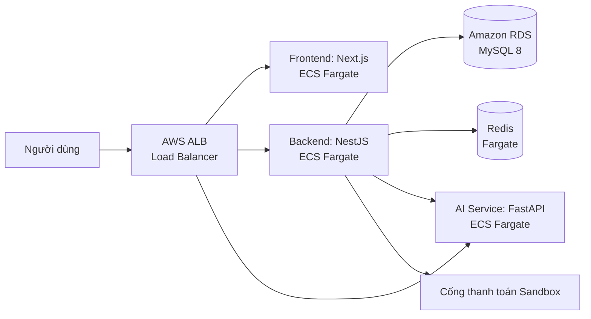

# Nền tảng gây quỹ cộng đồng cho dự án xã hội và khởi nghiệp (DATN_2627)

> Nền tảng web hỗ trợ toàn bộ vòng đời của một chiến dịch gây quỹ, từ khởi tạo, xét duyệt, kêu gọi tài trợ và thanh toán đến cập nhật tiến độ, minh bạch việc sử dụng quỹ và báo cáo; đồng thời tích hợp AI để gợi ý dự án, dự đoán khả năng thành công và phát hiện dấu hiệu bất thường.

## Mục lục

- [Tổng quan](#tổng-quan)
- [Mục tiêu & Phạm vi](#mục-tiêu--phạm-vi)
- [Đối tượng sử dụng](#đối-tượng-sử-dụng)
- [Chức năng chính](#chức-năng-chính)
- [Vòng đời chiến dịch](#vòng-đời-chiến-dịch)
- [Các mô-đun AI](#các-mô-đun-ai)
- [Kiến trúc hệ thống](#kiến-trúc-hệ-thống)
- [Cấu trúc mã nguồn & Công nghệ](#cấu-trúc-mã-nguồn--công-nghệ)
- [Khởi động Môi trường Local (Dev)](#khởi-động-môi-trường-local-dev)
- [Triển khai AWS Production (Terraform)](#triển-khai-aws-production-terraform)
- [Tiến độ triển khai](#tiến-độ-triển-khai)

---

## Tổng quan

Gây quỹ cộng đồng giúp các nhóm khởi nghiệp, tổ chức xã hội, câu lạc bộ sinh viên huy động nguồn lực từ cộng đồng thay vì phụ thuộc vào một nhà đầu tư lớn. Đề tài tập trung giải quyết các vấn đề:
- Người tài trợ khó tìm dự án phù hợp.
- Chủ dự án thiếu công cụ đánh giá chất lượng hồ sơ.
- Quản trị viên cần công cụ phát hiện gian lận tự động.
- Thiếu tính minh bạch trong quá trình giải ngân và thực hiện dự án.

## Mục tiêu & Phạm vi

**Mục tiêu:** Xây dựng cổng thông tin gây quỹ tích hợp AI (gợi ý, dự đoán, phát hiện gian lận) với giao diện responsive, dữ liệu minh bạch và kiến trúc Cloud-native có khả năng mở rộng.

**Phạm vi:**
- Hỗ trợ toàn bộ vòng đời chiến dịch (Nháp -> Chờ duyệt -> Đang gây quỹ -> Thành công/Thất bại).
- Tích hợp cổng thanh toán Sandbox (mô phỏng).
- AI chỉ đóng vai trò **hỗ trợ quyết định (Human-in-the-loop)**, không tự động khóa/xóa dự án.
- *Ngoài phạm vi:* Xử lý tiền thật, eKYC chuyên sâu.

## Đối tượng sử dụng

| Tác nhân | Nhu cầu và quyền chính |
| --- | --- |
| **Khách truy cập** | Xem, tìm kiếm và lọc dự án; xem số liệu gây quỹ; đăng ký. |
| **Người tài trợ** | Nhận gợi ý cá nhân hóa; tài trợ; xem giao dịch/biên nhận; báo cáo. |
| **Chủ dự án** | Tạo chiến dịch; theo dõi dashboard số liệu; cập nhật tiến độ, chứng từ. |
| **Quản trị viên** | Xét duyệt hồ sơ; quản lý người dùng/giao dịch; xem cảnh báo AI; audit log. |

## Chức năng chính

1. **Tài khoản và phân quyền:** Đăng ký, đăng nhập JWT, phân quyền Admin/Owner/Donor, quản lý hồ sơ.
2. **Chiến dịch gây quỹ:** Trình tạo chiến dịch (Wizard), duyệt/từ chối, dashboard số liệu thống kê.
3. **Khám phá và tương tác:** Trang chủ cá nhân hóa, tìm kiếm/lọc, bình luận, theo dõi dự án.
4. **Tài trợ và giao dịch:** Tạo đơn, thanh toán Sandbox, webhook bảo mật (idempotency key), xuất biên nhận.
5. **Tiến độ và minh bạch:** Cập nhật mốc thời gian, chứng từ chi tiêu, tính toán tỷ lệ tự động từ giao dịch.
6. **Quản trị:** Dashboard tổng hợp, xét duyệt, xử lý khiếu nại, cảnh báo rủi ro.

## Vòng đời chiến dịch


## Các mô-đun AI

1. **Gợi ý dự án phù hợp:** Lọc cộng tác và nội dung. Fallback về danh sách phổ biến khi AI lỗi. Có giải thích lý do gợi ý.
2. **Dự đoán khả năng thành công:** Phân loại nhị phân (Logistic Regression / Random Forest) dựa trên mục tiêu, nội dung, tương tác đầu. Phục vụ tư vấn chủ dự án.
3. **Phát hiện gian lận:** 2 tầng (Luật nghiệp vụ + Isolation Forest). Đưa ra cảnh báo rủi ro cho Admin xét duyệt (Human-in-the-loop).

## Kiến trúc hệ thống

Dự án được xây dựng theo kiến trúc Microservices cơ bản, giao tiếp qua REST API.



## Cấu trúc mã nguồn & Công nghệ

| Thư mục/Thành phần | Công nghệ sử dụng | Chức năng |
| --- | --- | --- |
| `frontend/` | React 19, Next.js 16, Tailwind | Giao diện SSR/SSG, User & Admin Dashboard |
| `backend/` | Node.js, NestJS 12, TypeORM | Core API, Business logic, Auth, DB interaction |
| `ai-service/` | Python 3.12, FastAPI, scikit-learn | Model inference, training offline, gợi ý & dự đoán |
| `infra/terraform/` | Terraform (AWS Provider) | Infrastructure as Code (IaC) để tự động hóa AWS |
| `infra/` | Docker, Docker Compose, Nginx | Môi trường chạy local tổng hợp |

> **Lưu ý Lệch chuẩn (ADR):** Đề cương ban đầu ghi Backend dùng Spring Boot, tuy nhiên thực tế nhóm chọn NestJS để dùng chung TypeScript với Frontend (xem `docs/architecture/adr-001-backend-stack.md`).

---

## Khởi động Môi trường Local (Dev)

Chạy trên máy tính cá nhân bằng Docker Compose (Dành cho Dev/Test).

1. **Chuẩn bị file môi trường:**
   ```powershell
   Copy-Item frontend/.env.example frontend/.env.local
   Copy-Item backend/.env.example backend/.env
   Copy-Item .env.example .env
   ```

2. **Chạy toàn bộ hệ thống bằng Docker Compose:**
   ```powershell
   docker compose -f infra/compose.yaml up --build -d
   ```
   *Frontend: `http://localhost:3000` | Backend: `http://localhost:4000/api/v1` | AI: `http://localhost:8000`*

3. **Chạy từng service (Development mode):**
   ```powershell
   .\scripts\npm-local.cmd run dev:frontend
   .\scripts\npm-local.cmd run dev:backend
   cd ai-service && ..\scripts\python-ai.cmd -m uvicorn app.main:app --reload
   ```

---

## Triển khai AWS Production (Terraform)

Hệ thống hạ tầng (Infrastructure as Code) đã được viết sẵn bằng Terraform tại thư mục `infra/terraform`. Kiến trúc này triển khai toàn bộ dự án lên mạng AWS với các tính năng:
- **Tối ưu chi phí đồ án:** Sử dụng **Public Subnet** cho Fargate Task để tránh tốn $32/tháng tiền NAT Gateway, nhưng khóa hoàn toàn inbound traffic bằng **Security Group** (chỉ cho phép Load Balancer gọi vào). Dùng Redis trên Fargate thay cho ElastiCache.
- **AWS Application Load Balancer (ALB):** Tự động chia tải và định tuyến API.
- **Amazon RDS:** Dành cho MySQL 8 (Dùng bản t4g.micro siêu tiết kiệm).

### Các bước triển khai:

1. **Khởi tạo và tạo kho chứa Docker (Amazon ECR):**
   ```bash
   cd infra/terraform
   terraform init
   terraform apply -target="aws_ecr_repository.frontend" -target="aws_ecr_repository.backend" -target="aws_ecr_repository.ai_service"
   ```

2. **Build và Push Docker Images:**
   Đăng nhập vào AWS ECR, build 3 image từ 3 `Dockerfile` ở thư mục gốc và push lên các kho ECR vừa tạo.

3. **Tạo toàn bộ hệ thống (Cluster, Load Balancer, RDS, Container):**
   ```bash
   terraform apply
   ```
   *Khi chạy xong, terminal sẽ in ra URL truy cập của Load Balancer (Ví dụ: `gopmam-alb-xxx.ap-southeast-1.elb.amazonaws.com`).*

4. **Tạm dừng / Dọn dẹp (Để không tốn tiền khi đi ngủ):**
   ```bash
   terraform destroy
   ```

---

## Tiến độ triển khai

> Cập nhật mới nhất: **25/09/2026**

| Hạng mục | Trạng thái | Ghi chú |
| --- | --- | --- |
| **Cơ sở dữ liệu** | ✅ Đã hoàn thành | Entities, migration, seed (User, Campaign, Donation, Progress, Audit log). |
| **Xác thực & Bảo mật** | ✅ Đã hoàn thành | JWT, Rate limit (Redis khi có, tự rơi về bộ nhớ), chống Brute-force login, RolesGuard, helmet, CORS thu hẹp, không trả hash mật khẩu/email ra API công khai (ClassSerializerInterceptor). |
| **Core: Chiến dịch** | ✅ Đã hoàn thành | Đầy đủ vòng đời, ma trận chuyển trạng thái khi kiểm duyệt, job cron tự động chốt `active` hết hạn → success/failed, lọc/tìm kiếm. |
| **Core: Tài trợ** | ✅ Đã hoàn thành | Giao dịch Idempotency, chặn tài trợ hết hạn, Webhook HMAC chống replay (timestamp) + chống race khi xử lý đồng thời. |
| **Core: Tiến độ** | ✅ Đã hoàn thành | Mốc thời gian, tính tự động % hoàn thành, audit log cho mọi thay đổi mốc/bài cập nhật. |
| **Dịch vụ AI** | ✅ Đã hoàn thành | FastAPI routes (recommend, predict, fraud), model registry. |
| **Kiểm duyệt (Moderation)** | ✅ Cơ bản | Người dùng báo cáo vi phạm chiến dịch; admin xem xét, kết luận có lý do, có thể tạm dừng chiến dịch; toàn bộ ghi audit (human-in-the-loop). |
| **Giao diện (Frontend)** | ✅ Đã hoàn thành | Thiết kế lại toàn bộ (25/09/2026): trang chủ, danh sách, chi tiết (sổ cái giao dịch công khai), đăng nhập/đăng ký, tạo chiến dịch 4 bước, dashboard chủ dự án, quản trị. Một file CSS `theme.css`; SEO: metadata/Open Graph, `sitemap.xml`, `robots.txt`, JSON-LD. |
| **Hạ tầng & Triển khai** | ✅ Đã hoàn thành | **AWS Terraform (ECS Fargate, ALB, RDS)** hoàn tất. Docker Compose local đã chạy đủ 6 service (nginx, frontend, backend, AI, MySQL, Redis) và qua smoke test. |
| **Kiểm thử** | 🔶 Đang tiến hành | Unit tests API backend đạt ~80%. Cần viết thêm E2E. |

*Tài liệu README này mô tả chuẩn xác thực trạng hệ thống ở thời điểm hiện tại và sẽ được cập nhật liên tục.*
