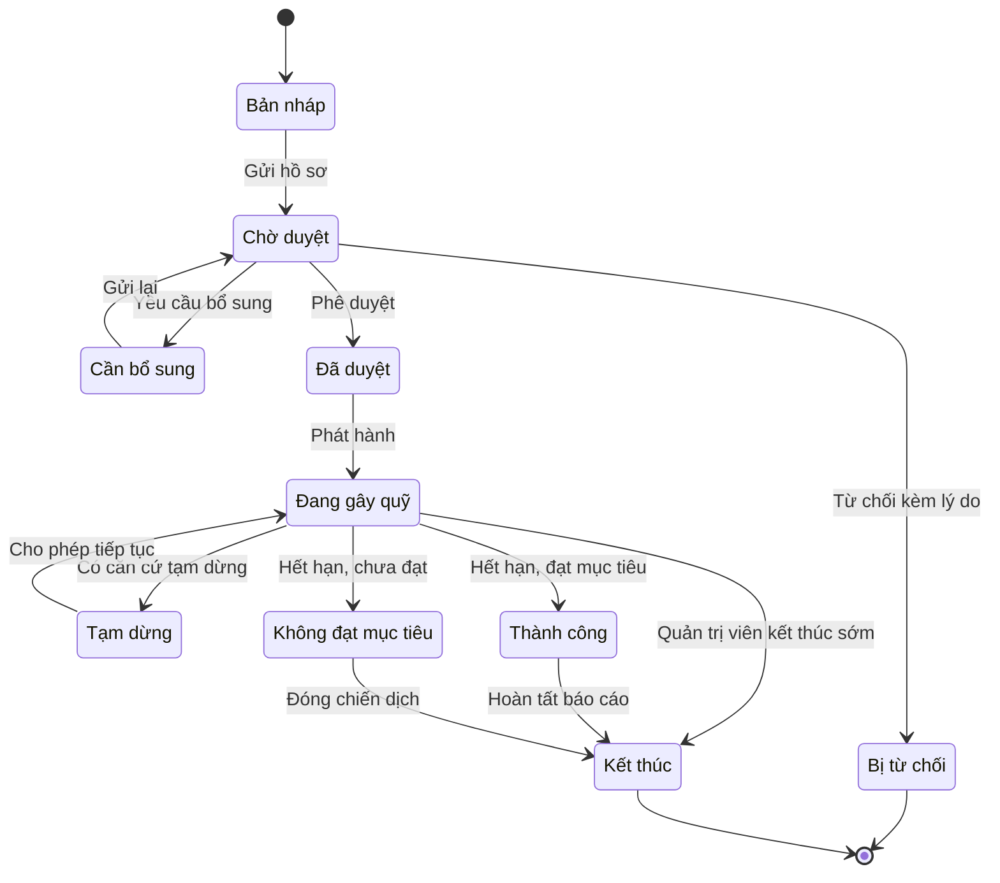
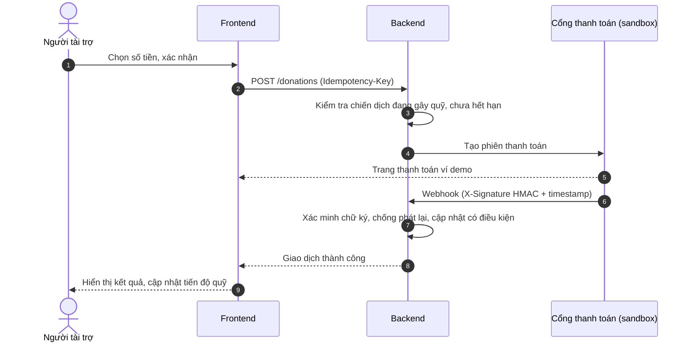
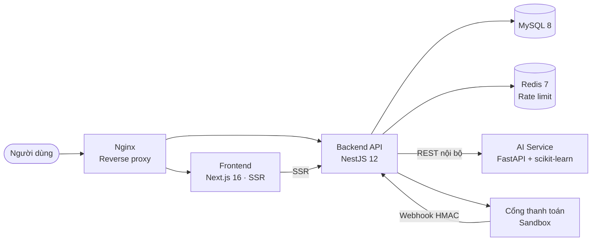

<div align="center">

# GÓP MẦM
### Xây dựng nền tảng gây quỹ cộng đồng cho các dự án xã hội và khởi nghiệp
*Tích hợp trí tuệ nhân tạo trong gợi ý dự án, dự đoán khả năng thành công và phát hiện gian lận*


</div>

---

## Thông tin đồ án

| Mục | Nội dung |
| --- | --- |
| **Tên đề tài** | Xây dựng nền tảng gây quỹ cộng đồng cho các dự án xã hội và khởi nghiệp |
| **Mã đề tài** | DATN_2627 |
| **Loại đồ án** | Đồ án tốt nghiệp |
| **Sinh viên thực hiện** | Trần Hữu Nhân |
| **Giảng viên hướng dẫn** | *(cập nhật)* |
| **Đơn vị** | *(cập nhật: Khoa / Trường)* |
| **Năm thực hiện** | 2026 |

---

## Mục lục

1. [Giới thiệu đề tài](#1-giới-thiệu-đề-tài)
2. [Mục tiêu](#2-mục-tiêu)
3. [Đối tượng và phạm vi](#3-đối-tượng-và-phạm-vi)
4. [Tác nhân và nhu cầu sử dụng](#4-tác-nhân-và-nhu-cầu-sử-dụng)
5. [Chức năng hệ thống](#5-chức-năng-hệ-thống)
6. [Quy trình nghiệp vụ trọng tâm](#6-quy-trình-nghiệp-vụ-trọng-tâm)
7. [Các mô-đun trí tuệ nhân tạo](#7-các-mô-đun-trí-tuệ-nhân-tạo)
8. [Kiến trúc và công nghệ](#8-kiến-trúc-và-công-nghệ)
9. [Thiết kế cơ sở dữ liệu](#9-thiết-kế-cơ-sở-dữ-liệu)
10. [Bảo mật và yêu cầu phi chức năng](#10-bảo-mật-và-yêu-cầu-phi-chức-năng)
11. [Cài đặt và chạy hệ thống](#11-cài-đặt-và-chạy-hệ-thống)
12. [Kiểm thử](#12-kiểm-thử)
13. [Triển khai](#13-triển-khai)
14. [Cấu trúc mã nguồn](#14-cấu-trúc-mã-nguồn)
15. [Kết quả, hạn chế và hướng phát triển](#15-kết-quả-hạn-chế-và-hướng-phát-triển)
16. [Tài liệu liên quan](#16-tài-liệu-liên-quan)

---

## 1. Giới thiệu đề tài

### 1.1. Bối cảnh

Gây quỹ cộng đồng (crowdfunding) là phương thức huy động nguồn lực giàu tiềm năng cho các nhóm khởi nghiệp, tổ chức xã hội, câu lạc bộ sinh viên và cá nhân có sáng kiến phục vụ cộng đồng. Thay vì phụ thuộc vào một nhà đầu tư lớn, chủ dự án trình bày ý tưởng trên nền tảng trực tuyến, đặt mục tiêu tài chính và tiếp cận nhiều người ủng hộ. Mô hình này vừa tạo nguồn vốn, vừa giúp kiểm chứng nhu cầu thị trường và lan tỏa giá trị xã hội của dự án.

### 1.2. Vấn đề đặt ra

Các nền tảng gây quỹ thông thường còn tồn tại một số hạn chế:

- **Người tài trợ** khó tìm được dự án thực sự phù hợp khi số lượng chiến dịch ngày càng lớn.
- **Chủ dự án** thiếu công cụ đánh giá chất lượng hồ sơ và khả năng đạt mục tiêu trước khi phát hành.
- **Ban quản trị** phải xử lý rủi ro từ thông tin sai lệch, giao dịch bất thường và chiến dịch có dấu hiệu gian lận.
- **Việc sử dụng quỹ** sau khi gây quỹ thiếu minh bạch, làm giảm niềm tin của cộng đồng.

### 1.3. Hướng giải quyết

Đề tài xây dựng nền tảng **Góp Mầm**, hỗ trợ toàn bộ vòng đời của một chiến dịch: khởi tạo và xét duyệt hồ sơ, kêu gọi tài trợ, thanh toán, cập nhật tiến độ, minh bạch nguồn quỹ và báo cáo. Điểm nổi bật là ba mô-đun AI độc lập, đóng vai trò **hỗ trợ ra quyết định** (không tự động kết luận) cho từng nhóm người dùng.

---

## 2. Mục tiêu

**Mục tiêu tổng quát:** Phân tích, thiết kế và triển khai một hệ thống web gây quỹ cộng đồng có quy mô phù hợp với đồ án tốt nghiệp, hoạt động theo kiến trúc nhiều lớp với các mô-đun AI độc lập; thể hiện được quy trình nghiệp vụ hoàn chỉnh, giao diện thân thiện, dữ liệu có khả năng truy vết và kết quả AI có thể đo lường.

**Mục tiêu cụ thể:**

1. Xây dựng cổng thông tin cho phép khám phá, tìm kiếm, theo dõi và tài trợ các dự án xã hội hoặc khởi nghiệp.
2. Cung cấp không gian quản lý để chủ dự án tạo hồ sơ chiến dịch, gửi xét duyệt, theo dõi số tiền đã nhận và cập nhật tiến độ sử dụng quỹ.
3. Xây dựng quy trình kiểm duyệt và bảng điều khiển quản trị: người dùng, chiến dịch, giao dịch, báo cáo vi phạm và cảnh báo rủi ro.
4. Phát triển hệ thống gợi ý dự án dựa trên sở thích và hành vi của người dùng.
5. Xây dựng mô hình dự đoán xác suất chiến dịch đạt mục tiêu.
6. Phát hiện hành vi bất thường bằng cách kết hợp luật nghiệp vụ với học máy, cung cấp cảnh báo kèm bằng chứng thay vì tự động kết luận gian lận.
7. Đánh giá hệ thống theo tiêu chí phần mềm (đúng chức năng, bảo mật, khả dụng) và tiêu chí mô hình AI (độ chính xác, khả năng xếp hạng, tỷ lệ cảnh báo sai).

---

## 3. Đối tượng và phạm vi

**Đối tượng nghiên cứu:** quy trình gây quỹ cộng đồng theo mô hình nhận tài trợ trực tuyến; dữ liệu chiến dịch và hành vi người dùng; các phương pháp học máy cho bài toán gợi ý, phân loại và phát hiện bất thường.

| Trong phạm vi | Ngoài phạm vi |
| --- | --- |
| Website responsive dùng được trên máy tính và thiết bị di động | Ứng dụng di động native |
| Toàn bộ vòng đời chiến dịch, từ bản nháp đến kết thúc | Xử lý tiền thật (chưa đáp ứng yêu cầu pháp lý với trung gian thanh toán) |
| Cổng thanh toán **sandbox** (ví demo), webhook có chữ ký | Lưu trữ thông tin thẻ ngân hàng |
| Ba mô-đun AI: gợi ý, dự đoán, phát hiện gian lận | eKYC / xác thực danh tính pháp lý chuyên sâu |
| Kiểm duyệt có con người tham gia (human-in-the-loop) | AI tự động khóa, từ chối hoặc xóa |

---

## 4. Tác nhân và nhu cầu sử dụng

| Tác nhân | Nhu cầu và quyền chính |
| --- | --- |
| **Khách truy cập** | Xem, tìm kiếm, lọc dự án; xem số liệu gây quỹ công khai; đăng ký tài khoản. |
| **Người tài trợ** | Nhận gợi ý cá nhân hóa; tài trợ; xem lịch sử giao dịch và tiến độ sử dụng quỹ; báo cáo vi phạm. |
| **Chủ dự án** | Tạo và chỉnh sửa chiến dịch; gửi xét duyệt; theo dõi số liệu; công bố cập nhật và mốc tiến độ. Một tài khoản có thể đồng thời là người tài trợ. |
| **Quản trị viên** | Xét duyệt chiến dịch; quản lý và khóa/mở tài khoản; xử lý báo cáo vi phạm; xem cảnh báo rủi ro AI; tra cứu nhật ký kiểm toán. |
| **Hệ thống ngoài** | Cổng thanh toán (sandbox), dịch vụ email, lưu trữ tệp. Được đóng gói qua interface để thay nhà cung cấp mà không ảnh hưởng nghiệp vụ lõi. |

Vai trò trong hệ thống: `user` (người tài trợ), `campaign_owner` (chủ dự án), `admin` (quản trị viên). Người dùng **không thể tự đăng ký vai trò `admin`**.

---

## 5. Chức năng hệ thống

| Nhóm chức năng | Nội dung đã triển khai | Trạng thái |
| --- | --- | :---: |
| **Tài khoản & phân quyền** | Đăng ký, đăng nhập JWT (access + refresh token), phân quyền theo vai trò và quyền sở hữu, quản lý hồ sơ, khóa tạm thời sau 5 lần đăng nhập sai trong 15 phút. | ✅ |
| **Quản lý chiến dịch** | Tạo chiến dịch theo 4 bước, gửi duyệt, kiểm duyệt theo ma trận chuyển trạng thái, tạm dừng/tiếp tục, tự động chốt chiến dịch hết hạn (thành công/không đạt), tìm kiếm, lọc, sắp xếp. | ✅ |
| **Tài trợ & giao dịch** | Tạo giao dịch với idempotency key, thanh toán qua ví demo, webhook xác thực chữ ký HMAC và chống phát lại, chặn tài trợ vào chiến dịch đã hết hạn, sổ cái giao dịch công khai. | ✅ |
| **Tiến độ & minh bạch** | Mốc tiến độ, bài cập nhật, tỷ lệ hoàn thành và số liệu quỹ **sinh từ giao dịch đã xác minh**. | ✅ |
| **Kiểm duyệt nội dung** | Báo cáo vi phạm chiến dịch (chặn tự báo cáo và báo cáo trùng), hàng đợi xử lý của quản trị viên, bắt buộc ghi chú kết luận, tùy chọn tạm dừng chiến dịch. | ✅ |
| **Quản trị** | Dashboard tổng quan, quản lý người dùng, xử lý cảnh báo rủi ro, xem nhật ký kiểm toán theo đối tượng. | ✅ |
| **Trí tuệ nhân tạo** | Gợi ý dự án, dự đoán khả năng thành công, chấm điểm rủi ro gian lận; có giải thích, phiên bản mô hình và phương án dự phòng. | ✅ |
| **Giao diện** | Trang chủ, danh sách và chi tiết dự án, đăng nhập/đăng ký, tạo chiến dịch, dashboard chủ dự án, trang quản trị; SEO (metadata, Open Graph, sitemap, JSON-LD). | ✅ |
| **Thông báo** | Email và thông báo trong ứng dụng (mới có mô hình dữ liệu). | 🔶 |
| **Tương tác cộng đồng** | Bình luận, theo dõi dự án. | ⏳ |

> ✅ Đã triển khai · 🔶 Triển khai một phần · ⏳ Kế hoạch

---

## 6. Quy trình nghiệp vụ trọng tâm

### 6.1. Vòng đời chiến dịch

Mọi chuyển trạng thái được kiểm tra ở server theo ma trận cho phép. Mỗi thay đổi đều ghi nhật ký kiểm toán (thời điểm, người thực hiện, giá trị trước/sau).



### 6.2. Luồng tài trợ và xác nhận thanh toán

Trạng thái giao dịch chỉ được cập nhật sau khi **xác minh chữ ký** phản hồi từ cổng thanh toán. Trình duyệt không bao giờ gọi trực tiếp webhook.



---

## 7. Các mô-đun trí tuệ nhân tạo

Ba mô-đun chạy trong dịch vụ `ai-service` riêng (FastAPI + scikit-learn). Backend gọi AI qua lớp proxy, chỉ gửi dữ liệu tối thiểu đã chuẩn hóa. Mọi kết quả đều kèm **giải thích** và **phiên bản mô hình**. Khi dịch vụ AI gián đoạn, hệ thống có **phương án dự phòng** không dùng AI, và việc thanh toán không phụ thuộc vào AI.

| Mô-đun | Phương pháp | Người hưởng lợi | Dự phòng |
| --- | --- | --- | --- |
| **Gợi ý dự án** | Lọc theo nội dung (sở thích, danh mục) kết hợp tín hiệu cộng tác từ lịch sử tương tác, có suy giảm theo thời gian; trả về lý do gợi ý. | Người tài trợ | Danh sách dự án phổ biến |
| **Dự đoán khả năng thành công** | Phân loại nhị phân; so sánh Logistic Regression với Random Forest, chọn theo ROC-AUC; hiển thị các yếu tố ảnh hưởng. | Chủ dự án, quản trị viên | Không hiển thị điểm, không chặn nghiệp vụ |
| **Phát hiện gian lận** | Hai tầng: luật nghiệp vụ + Isolation Forest (chuẩn hóa StandardScaler). Tạo cảnh báo rủi ro kèm nhóm nguyên nhân. | Quản trị viên | Chỉ áp dụng tầng luật |

**Kết quả đánh giá** (phiên bản mô hình `2026.09.1`, huấn luyện ngày 11/09/2026):

| Mô-đun | Dữ liệu | Cách chia | Chỉ số |
| --- | --- | --- | --- |
| Dự đoán thành công (Random Forest) | 1.000 chiến dịch | Theo thời gian 80/20 | ROC-AUC 0,685 · F1 0,627 · Precision 0,697 · Recall 0,570 |
| Dự đoán thành công (Logistic Regression, baseline) | 1.000 chiến dịch | Theo thời gian 80/20 | ROC-AUC 0,573 · F1 0,522 |
| Phát hiện gian lận (Isolation Forest) | 2.040 giao dịch (2% bất thường) | — | Tỷ lệ phát hiện 97,5% · Tỷ lệ cảnh báo sai 0,1% |
| Gợi ý dự án | 6.000 sự kiện, 300 người dùng | Theo thời gian 80/20 | Precision@10 0,012 · Recall@10 0,031 · NDCG@10 0,021 |

> **Giới hạn dữ liệu:** Các chỉ số trên đo trên **dữ liệu tổng hợp (synthetic) sinh có seed cố định**, do nền tảng mới chưa có dữ liệu thực. Chúng chứng minh pipeline huấn luyện – đánh giá – suy luận hoạt động đúng, **không** phản ánh hiệu năng trên dữ liệu thật. Chi tiết tái lập: [`ai-service/data/README.md`](ai-service/data/README.md), [`ai-service/training/`](ai-service/training).

**Nguyên tắc AI có trách nhiệm:** AI chỉ hỗ trợ; mọi quyết định khóa, từ chối hoặc tạm dừng đều do quản trị viên xác nhận. Kết quả dự đoán không phải cam kết và không được dùng làm căn cứ duy nhất để từ chối chiến dịch. Hệ thống không công khai cáo buộc gian lận.

---

## 8. Kiến trúc và công nghệ

### 8.1. Kiến trúc tổng thể

Hệ thống gồm ba thành phần ứng dụng độc lập, giao tiếp qua REST API có phiên bản (`/api/v1`), đặt sau Nginx làm reverse proxy.



Kiến trúc backend theo mô-đun nghiệp vụ, mỗi mô-đun tổ chức theo lớp **Controller → Service → Repository (TypeORM) → Entity**. Các tích hợp ngoài (thanh toán, AI, email, lưu trữ) nằm trong `backend/src/integrations/` dưới dạng interface, luôn có bản giả lập (sandbox) để kiểm thử.

### 8.2. Công nghệ sử dụng

| Thành phần | Công nghệ | Vai trò |
| --- | --- | --- |
| **Frontend** | Next.js 16, React 19, TypeScript | Giao diện responsive, render phía máy chủ, SEO |
| **Backend** | NestJS 12, TypeScript, TypeORM, class-validator | Nghiệp vụ, xác thực/phân quyền, giao dịch, kiểm toán |
| **AI Service** | Python 3.12, FastAPI, scikit-learn, pandas, NumPy | Huấn luyện ngoại tuyến và suy luận mô hình |
| **Cơ sở dữ liệu** | MySQL 8 | Lưu trữ dữ liệu nghiệp vụ, migration có rollback |
| **Bộ nhớ đệm** | Redis 7 | Giới hạn tần suất (tự chuyển về bộ nhớ trong nếu Redis lỗi) |
| **Hạ tầng** | Docker Compose, Nginx, Terraform (AWS ECS Fargate, ALB, RDS) | Môi trường chạy thống nhất và triển khai đám mây |
| **Tài liệu API** | OpenAPI 3 / Swagger | Mô tả hợp đồng dịch vụ |

> **Ghi chú về quyết định kỹ thuật:** Đề cương ban đầu dự kiến backend Java Spring Boot. Trong quá trình thực hiện, backend được chuyển sang **NestJS** để frontend và backend dùng chung hệ sinh thái TypeScript, giảm số ngôn ngữ phải duy trì, trong khi vẫn giữ nguyên ranh giới nghiệp vụ và kiến trúc nhiều lớp. Lý do và hệ quả được ghi tại [ADR-001](docs/architecture/adr-001-backend-stack.md).

---

## 9. Thiết kế cơ sở dữ liệu

Các nhóm bảng chính:

| Nhóm | Bảng |
| --- | --- |
| Tài khoản | `users` |
| Chiến dịch & tiến độ | `campaigns`, `milestones`, `milestone_updates` |
| Giao dịch | `donations` |
| Kiểm duyệt & rủi ro | `reports`, `risk_alerts` |
| AI | `behavior_events` (sự kiện hành vi phục vụ gợi ý) |
| Hệ thống | `notifications`, `audit_logs` |

Nguyên tắc thiết kế: khóa chính **UUID**; **xóa mềm** cho dữ liệu quan trọng; **nhật ký kiểm toán** cho mọi thay đổi quan trọng; schema chỉ thay đổi qua **migration có thứ tự và có rollback** (không dùng auto-sync), tương thích cả MySQL 8 và MariaDB.

Tài liệu chi tiết: [ERD](docs/database/erd.md) · [Schema SQL](docs/database/schema.sql) · [Dữ liệu mẫu](docs/database/seed.sql).

---

## 10. Bảo mật và yêu cầu phi chức năng

**Bảo mật**

- Mật khẩu băm bcrypt; JWT access/refresh token; không bao giờ trả `passwordHash` hay thông tin khóa tài khoản ra API. Email và số điện thoại chỉ trả về ở API người dùng và quản trị.
- Phân quyền theo vai trò **và** quyền sở hữu, kiểm tra ở server (`JwtAuthGuard`, `RolesGuard`).
- Giới hạn tần suất yêu cầu; khóa tạm tài khoản khi đăng nhập sai nhiều lần.
- Webhook thanh toán xác minh chữ ký HMAC, chống phát lại bằng timestamp, idempotent và cập nhật có điều kiện để tránh xử lý trùng khi có yêu cầu đồng thời.
- `helmet`, CORS giới hạn nguồn; kiểm tra dữ liệu đầu vào bằng DTO; ORM tham số hóa truy vấn để chống SQL injection.
- Bí mật (secret) nằm ngoài mã nguồn; repo chỉ chứa `.env.example` với giá trị giữ chỗ.
- Không lưu thông tin thẻ; chủ dự án không xem được thông tin thanh toán nhạy cảm của người tài trợ.

**Phi chức năng**

- *Hiệu năng:* phân trang cho danh sách lớn; dịch vụ không lưu trạng thái, có thể mở rộng ngang.
- *Tin cậy:* job định kỳ tự chốt chiến dịch hết hạn; AI có phương án dự phòng.
- *Truy vết:* số liệu quỹ sinh từ giao dịch đã xác minh; nhật ký kiểm toán ghi thời điểm, người thực hiện và giá trị trước/sau.
- *Khả dụng:* giao diện nhất quán, responsive, thông báo lỗi dễ hiểu.

---

## 11. Cài đặt và chạy hệ thống

### 11.1. Yêu cầu

- Node.js ≥ 22, npm
- Python 3.12
- Docker Desktop (khuyến nghị) hoặc MySQL 8 và Redis 7 cài riêng

### 11.2. Chạy toàn bộ bằng Docker Compose

```powershell
Copy-Item .env.example .env
docker compose -f infra/compose.yaml up --build -d
```

Compose khởi động 6 dịch vụ: `nginx`, `frontend`, `backend`, `ai-service`, `mysql`, `redis`.

| Dịch vụ | Địa chỉ |
| --- | --- |
| Qua Nginx | `http://localhost:8080` |
| Frontend | `http://localhost:3000` |
| Backend API | `http://localhost:4000/api/v1` |
| AI Service (Swagger) | `http://localhost:8000/docs` |

### 11.3. Chạy từng dịch vụ ở chế độ phát triển

```powershell
# 1. Cài đặt phụ thuộc
.\scripts\npm-local.cmd install
cd ai-service; ..\scripts\python-ai.cmd -m pip install -r requirements-dev.txt; cd ..

# 2. Tạo file môi trường
Copy-Item frontend/.env.example frontend/.env.local
Copy-Item backend/.env.example backend/.env

# 3. Khởi tạo cơ sở dữ liệu (MySQL phải đang chạy)
cd backend
..\scripts\npm-local.cmd run migration:run
..\scripts\npm-local.cmd run seed
cd ..

# 4. Chạy ba dịch vụ (mỗi lệnh một terminal)
.\scripts\npm-local.cmd run dev:frontend
.\scripts\npm-local.cmd run dev:backend
cd ai-service; ..\scripts\python-ai.cmd -m uvicorn app.main:app --reload
```

### 11.4. Thanh toán thử nghiệm

Hệ thống dùng **ví demo (sandbox)**, không phát sinh giao dịch tiền thật. Để thử webhook có chữ ký từ dòng lệnh:

```powershell
cd backend
..\scripts\npm-local.cmd run sign-webhook
```

---

## 12. Kiểm thử

| Loại | Công cụ | Phạm vi |
| --- | --- | --- |
| Unit test backend | `node --test` | Xác thực, người dùng, chiến dịch (chuyển trạng thái, tự chốt hết hạn), tài trợ, sổ cái, tiến độ, kiểm duyệt, quản trị, cảnh báo rủi ro, rate limit, kiểm toán, tuần tự hóa dữ liệu nhạy cảm |
| Test AI service | `pytest` | Gợi ý, dự đoán, phát hiện gian lận, health, bảo mật |
| Kiểm tra tĩnh | TypeScript, ESLint, Ruff | Kiểu dữ liệu, quy ước mã |
| Smoke test | Docker Compose + Nginx | Toàn bộ 6 dịch vụ |

```powershell
.\scripts\npm-local.cmd run check          # typecheck + lint + unit test
.\scripts\npm-local.cmd run build          # build backend và frontend
.\scripts\python-ai.cmd -m pytest -q ai-service
.\scripts\python-ai.cmd -m ruff check ai-service
```

Kịch bản kiểm thử đầu-cuối (E2E) theo luồng *đăng ký chủ dự án → nộp hồ sơ → xét duyệt → phát hành → nhận tài trợ → cập nhật tiến độ* đang được hoàn thiện. Xem thêm [`docs/testing/`](docs/testing/README.md).

---

## 13. Triển khai

### 13.1. AWS với Terraform

Hạ tầng được mô tả dưới dạng mã (Infrastructure as Code) tại [`infra/terraform/`](infra/terraform):

- **Amazon ECS Fargate** chạy frontend, backend, AI service và Redis.
- **Application Load Balancer** định tuyến theo đường dẫn.
- **Amazon RDS** cho MySQL 8 (lớp `t4g.micro`).
- **Amazon ECR** lưu Docker image.
- *Tối ưu chi phí:* task Fargate đặt trong public subnet để không cần NAT Gateway, inbound bị khóa bằng Security Group (chỉ ALB được gọi vào).

```bash
cd infra/terraform
terraform init
# Tạo kho ECR trước để push image
terraform apply -target=aws_ecr_repository.frontend -target=aws_ecr_repository.backend -target=aws_ecr_repository.ai_service
# Build và push 3 image lên ECR, sau đó tạo toàn bộ hạ tầng
terraform apply
# Dọn tài nguyên khi không dùng để tránh phát sinh chi phí
terraform destroy
```

### 13.2. Hosting MySQL

Hướng dẫn đưa schema và dữ liệu mẫu lên hosting MySQL: [`docs/operations/`](docs/operations/README.md).

---

## 14. Cấu trúc mã nguồn

```
DATN_2627_Website/
├── frontend/                 # Next.js 16 – giao diện người dùng
│   └── src/
│       ├── app/              # Định tuyến: /, /du-an, /du-an/[slug], /dang-nhap,
│       │                     #   /dang-ky, /tao-chien-dich, /dashboard, /admin
│       ├── features/         # Mô-đun giao diện theo nghiệp vụ
│       ├── components/       # Thành phần dùng chung
│       └── lib/api/          # Lớp gọi API backend
├── backend/                  # NestJS 12 – API nghiệp vụ
│   ├── src/
│   │   ├── modules/          # auth, users, campaigns, donations, progress,
│   │   │                     #   moderation, admin, ai, notifications, health
│   │   ├── integrations/     # ai, payment, email, storage (interface + sandbox)
│   │   └── common/           # Guard, interceptor, tiện ích dùng chung
│   ├── database/migrations/  # Migration TypeORM có rollback
│   └── test/                 # Unit test
├── ai-service/               # FastAPI – mô-đun AI
│   ├── app/                  # API suy luận: recommend, predict, fraud
│   ├── training/             # Sinh dữ liệu, huấn luyện, đánh giá
│   ├── models/               # Mô hình đã huấn luyện + chỉ số đánh giá
│   ├── data/                 # Dữ liệu tổng hợp
│   └── tests/
├── infra/                    # Docker Compose, Nginx, Terraform
├── docs/                     # Kiến trúc, API, cơ sở dữ liệu, kiểm thử, vận hành
└── scripts/                  # Script chạy Node/Python cục bộ
```

---

## 15. Kết quả, hạn chế và hướng phát triển

### 15.1. Kết quả đạt được

- Hoàn thiện quy trình gây quỹ khép kín: tạo chiến dịch → xét duyệt → phát hành → tài trợ → xác nhận thanh toán → cập nhật tiến độ → kết thúc.
- Minh bạch nguồn quỹ nhờ sổ cái giao dịch công khai và số liệu tính từ giao dịch đã xác minh.
- Ba mô-đun AI độc lập, có giải thích, phiên bản mô hình và phương án dự phòng; quy trình kiểm duyệt có con người tham gia.
- Hệ thống chạy thống nhất bằng Docker Compose; hạ tầng AWS mô tả bằng Terraform; API mô tả đầy đủ bằng OpenAPI.

*Cập nhật lần cuối: 26/09/2026.*

### 15.2. Hạn chế

- Mô hình AI được huấn luyện trên dữ liệu tổng hợp; hiệu năng thực tế cần đánh giá lại khi có dữ liệu thật.
- Thanh toán chỉ ở mức sandbox; chưa có hoàn tiền và giải ngân thực tế.
- Chưa hoàn thiện thông báo (email, trong ứng dụng), bình luận và theo dõi dự án.
- Kiểm thử đầu-cuối tự động chưa hoàn chỉnh.

### 15.3. Hướng phát triển

- Tích hợp cổng thanh toán thật và eKYC qua nhà cung cấp chuyên nghiệp; ký quỹ và giải ngân theo mốc tiến độ.
- Hoàn thiện thông báo, bình luận, theo dõi dự án và thu thập dữ liệu hành vi có sự đồng ý của người dùng.
- Cập nhật mô hình AI định kỳ, giám sát trôi dữ liệu (drift), đánh giá công bằng giữa các nhóm dự án; phân tích mạng lưới để phát hiện nhóm tài khoản thông đồng.
- Ứng dụng di động, đa ngôn ngữ và đa loại tiền tệ.

---

## 16. Tài liệu liên quan

| Tài liệu | Đường dẫn |
| --- | --- |
| Đặc tả API (OpenAPI) | [`docs/api/openapi.yaml`](docs/api/openapi.yaml) |
| Cấu trúc dự án | [`docs/architecture/project-structure.md`](docs/architecture/project-structure.md) |
| Quyết định kiến trúc | [`docs/architecture/adr-001-backend-stack.md`](docs/architecture/adr-001-backend-stack.md) |
| Thiết kế cơ sở dữ liệu | [`docs/database/`](docs/database/README.md) |
| Kiểm thử | [`docs/testing/`](docs/testing/README.md) |
| Vận hành | [`docs/operations/`](docs/operations/README.md) |
| Hạ tầng | [`infra/README.md`](infra/README.md) |
| Dữ liệu và mô hình AI | [`ai-service/data/README.md`](ai-service/data/README.md) |

---

<div align="center">

**Góp Mầm** · Đồ án tốt nghiệp · 2026

</div>
