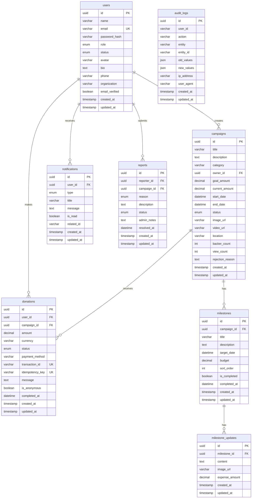

# Database Design

## ERD Overview

## Tables Description

### users
Lưu thông tin tài khoản người dùng. Một tài khoản có thể vừa là người tài trợ vừa là chủ dự án.

### campaigns
Quản lý vòng đời chiến dịch gây quỹ từ nháp đến kết thúc.

### donations
Ghi nhận các giao dịch tài trợ. Sử dụng `idempotency_key` để tránh ghi nhận trùng.

### milestones
Các mốc tiến độ của chiến dịch, giúp minh bạch việc sử dụng quỹ.

### milestone_updates
Cập nhật chi tiết cho từng mốc tiến độ (hình ảnh, chứng từ, chi tiêu).

### notifications
Thông báo cho người dùng về các sự kiện quan trọng.

### reports
Báo cáo vi phạm từ người dùng, được quản trị viên xử lý.

### audit_logs
Nhật ký thay đổi quan trọng trong hệ thống.

## Principles

- UUID cho primary keys
- Soft delete cho dữ liệu quan trọng (có thể bổ sung sau)
- Audit trail cho thay đổi quan trọng
- Webhook phải verify chữ ký
- Idempotency cho giao dịch
