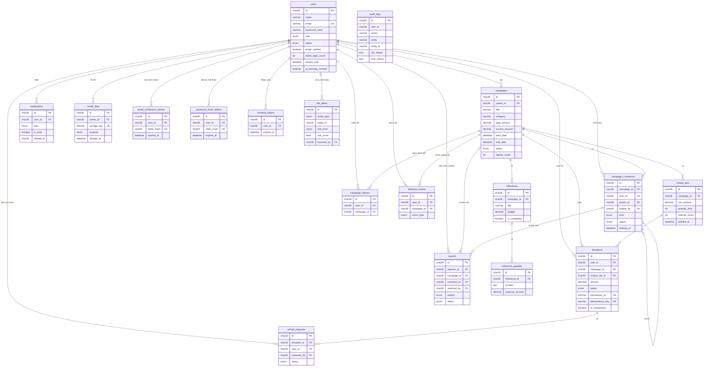

# Database Design

Schema MySQL 8 gồm **18 bảng** (khớp migration tới `1790000000002`). Định nghĩa cột đầy đủ ở [`schema.dbml`](./schema.dbml) (dán vào dbdiagram.io để vẽ ERD vật lý); đặc tả chi tiết từng thực thể và quan hệ ở [`dac-ta-erd.md`](./dac-ta-erd.md).

## ERD Overview

```mermaid
erDiagram
    users ||--o{ campaigns : "tạo"
    users ||--o{ donations : "ủng hộ"
    users ||--o{ campaign_comments : "bình luận"
    users ||--o{ campaign_follows : "theo dõi"
    users ||--o{ refund_requests : "yêu cầu hoàn"
    users ||--o{ reports : "báo cáo vi phạm"
    users ||--o{ notifications : "nhận"
    users ||--o{ behavior_events : "phát sinh"
    users ||--o{ media_files : "tải lên"
    users ||--o{ email_verification_tokens : "xác minh email"
    users ||--o{ password_reset_tokens : "đặt lại mật khẩu"
    users ||--o{ revoked_tokens : "đăng xuất"
    users |o--o{ risk_alerts : "xử lý cảnh báo"

    campaigns ||--o{ donations : "nhận"
    campaigns ||--o{ milestones : "có"
    campaigns ||--o{ reward_tiers : "có"
    campaigns ||--o{ campaign_comments : "có"
    campaigns ||--o{ campaign_follows : "được theo dõi"
    campaigns |o--o{ reports : "bị báo cáo"
    campaigns ||--o{ behavior_events : "được tương tác"

    milestones ||--o{ milestone_updates : "có"
    reward_tiers |o--o{ donations : "được chọn"
    donations ||--o{ refund_requests : "có"
    campaign_comments |o--o{ campaign_comments : "trả lời"
    campaign_comments |o--o{ reports : "bị báo cáo"

    users {
        char36 id PK
        varchar name
        varchar email UK
        varchar password_hash
        enum role
        enum status
        boolean email_verified
        int failed_login_count
        datetime locked_until
        boolean ai_tracking_consent
    }
    campaigns {
        char36 id PK
        char36 owner_id FK
        varchar title
        varchar category
        decimal goal_amount
        decimal current_amount
        datetime start_date
        datetime end_date
        enum status
        int backer_count
    }
    donations {
        char36 id PK
        char36 user_id FK
        char36 campaign_id FK
        char36 reward_tier_id FK
        decimal amount
        enum status
        varchar transaction_id UK
        varchar idempotency_key UK
        boolean is_anonymous
    }
    refund_requests {
        char36 id PK
        char36 donation_id FK
        char36 user_id FK
        char36 reviewed_by FK
        enum status
    }
    reward_tiers {
        char36 id PK
        char36 campaign_id FK
        decimal min_amount
        int quantity_limit
        int claimed_count
        datetime deleted_at
    }
    milestones {
        char36 id PK
        char36 campaign_id FK
        varchar title
        decimal budget
        boolean is_completed
    }
    milestone_updates {
        char36 id PK
        char36 milestone_id FK
        text content
        decimal expense_amount
    }
    campaign_comments {
        char36 id PK
        char36 campaign_id FK
        char36 user_id FK
        char36 parent_id FK
        char36 hidden_by FK
        enum kind
        enum status
        datetime deleted_at
    }
    campaign_follows {
        char36 id PK
        char36 user_id FK
        char36 campaign_id FK
    }
    reports {
        char36 id PK
        char36 reporter_id FK
        char36 campaign_id FK
        char36 comment_id FK
        char36 resolved_by FK
        enum reason
        enum status
    }
    risk_alerts {
        char36 id PK
        enum entity_type
        char36 entity_id
        enum risk_level
        float risk_score
        char36 resolved_by FK
    }
    behavior_events {
        char36 id PK
        char36 user_id FK
        char36 campaign_id FK
        enum event_type
    }
    media_files {
        char36 id PK
        char36 owner_id FK
        varchar storage_key UK
        enum purpose
        datetime deleted_at
    }
    notifications {
        char36 id PK
        char36 user_id FK
        enum type
        boolean is_read
        char36 related_id
    }
    email_verification_tokens {
        char36 id PK
        char36 user_id FK
        char64 token_hash UK
        datetime expires_at
    }
    password_reset_tokens {
        char36 id PK
        char36 user_id FK
        char64 token_hash UK
        datetime expires_at
    }
    revoked_tokens {
        char36 jti PK
        char36 user_id FK
        datetime expires_at
    }
    audit_logs {
        char36 id PK
        varchar user_id
        varchar action
        varchar entity
        varchar entity_id
        json old_values
        json new_values
    }
```

Sơ đồ chỉ hiện các cột chính; `created_at`/`updated_at` có ở mọi bảng (trừ `revoked_tokens` chỉ có `created_at`). Các quan hệ tới `users` qua cột người xử lý (`campaign_comments.hidden_by`, `reports.resolved_by`, `refund_requests.reviewed_by`) có FK nhưng không vẽ để sơ đồ đỡ rối — xem [`dac-ta-erd.md`](./dac-ta-erd.md).

## Tables Description

| Nhóm | Bảng | Vai trò |
| --- | --- | --- |
| Tài khoản | `users` | Người dùng; một tài khoản có thể vừa ủng hộ vừa làm chủ dự án |
| | `email_verification_tokens`, `password_reset_tokens` | Token một lần (lưu hash SHA-256) |
| | `revoked_tokens` | `jti` của JWT đã đăng xuất |
| Chiến dịch & tiến độ | `campaigns` | Vòng đời chiến dịch từ nháp đến kết thúc |
| | `milestones`, `milestone_updates` | Mốc tiến độ và cập nhật minh bạch chi tiêu |
| | `reward_tiers` | Mức ủng hộ kèm quà |
| | `media_files` | Ảnh tải lên (chiến dịch, tiến độ, avatar) |
| Giao dịch | `donations` | Giao dịch ủng hộ; `idempotency_key` chống ghi trùng |
| | `refund_requests` | Yêu cầu hoàn tiền do admin duyệt |
| Cộng đồng | `campaign_comments` | Bình luận/hỏi đáp, trả lời 1 cấp |
| | `campaign_follows` | Theo dõi chiến dịch (N-N users–campaigns) |
| Kiểm duyệt & rủi ro | `reports` | Báo cáo vi phạm chiến dịch hoặc bình luận |
| | `risk_alerts` | Cảnh báo gian lận từ AI/luật |
| AI | `behavior_events` | Hành vi xem/theo dõi/ủng hộ (chỉ ghi khi đồng ý) |
| Hệ thống | `notifications` | Thông báo trong ứng dụng |
| | `audit_logs` | Nhật ký thay đổi quan trọng |

## Principles

- UUID (`CHAR(36)`) cho primary keys
- Xóa mềm (`deleted_at`) cho `campaign_comments`, `reward_tiers`, `media_files`
- Audit trail cho thay đổi quan trọng
- Webhook phải verify chữ ký
- Idempotency cho giao dịch
